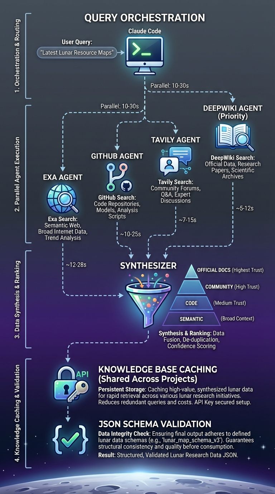

# Lunar-Research

Multi-agent research pipeline for Claude Code. Orchestrates 4 specialized researcher agents
(GitHub, Tavily, DeepWiki, Exa) and synthesizes findings with source authority hierarchy.


## Installation

Add the lunar-claude marketplace, then install the plugin:

```bash
/plugin marketplace add basher83/lunar-claude
/plugin install lunar-research@lunar-claude
```

## Setup

Set your API keys as environment variables. A SessionStart hook substitutes them into the
MCP configuration automatically.

### Option 1: Shell Profile (Recommended)

Add to `~/.bashrc`, `~/.zshrc`, or your shell's config:

```bash
export GITHUB_TOKEN="ghp_xxxxxxxxxxxx"
export TAVILY_API_KEY="tvly-xxxxxxxxxxxx"
export EXA_API_KEY="xxxxxxxx-xxxx-xxxx-xxxx-xxxxxxxxxxxx"
```

Run `source ~/.bashrc` or restart your terminal.

### Option 2: mise (Project-scoped)

Create `.mise.local.toml` in your project directory:

```toml
[env]
GITHUB_TOKEN = "ghp_xxxxxxxxxxxx"
TAVILY_API_KEY = "tvly-xxxxxxxxxxxx"
EXA_API_KEY = "xxxxxxxx-xxxx-xxxx-xxxx-xxxxxxxxxxxx"
```

Run `mise trust` to activate. The `.local.toml` suffix is gitignored.

### Getting API Keys

- **GitHub**: [Create a personal access token](https://github.com/settings/tokens)
- **Tavily**: [Get API key](https://tavily.com/)
- **Exa**: [Get API key](https://exa.ai/)

## Usage

```bash
/lunar-research:run "your research query"
/lunar-research:cache              # List cached research
/lunar-research:cache --detailed   # Show researcher status
```

## Features

- **4 Parallel Researchers**: GitHub (code/repos), Tavily (web/tutorials), DeepWiki (official docs),
  Exa (semantic search)
- **Synthesizer Agent**: Combines findings using authority hierarchy (official docs > community > code > semantic)
- **Knowledge Base Caching**: 30-day TTL cache shared across projects
- **Schema Validation**: JSON Schema for standardized report format

## How It Works



## Components

### Commands

| Command | Description |
|---------|-------------|
| `/lunar-research:run` | Main research orchestrator |
| `/lunar-research:cache` | List cached research entries |

### Agents

| Agent | Purpose | MCP Tools |
|-------|---------|-----------|
| `github-researcher` | Find repositories and code patterns | GitHub MCP |
| `tavily-researcher` | Find tutorials and community content | Tavily MCP |
| `deepwiki-researcher` | Find official documentation | DeepWiki MCP |
| `exa-researcher` | Semantic search for related content | Exa MCP |
| `synthesizer-agent` | Combine findings into synthesis | None |

### Schemas

- `research-report.schema.json` - JSON Schema for researcher output format

### Scripts

- `validate-research-report.py` - Validate reports against schema
- `setup-mcp-keys.sh` - API key configuration (if hook fails)

### Hooks

- `SessionStart` - Substitutes API keys from environment variables into `.mcp.json` on each
  session start. Run `/mcp` to reconnect if keys change mid-session.

## Cache Structure

The plugin caches research results and shares them across projects:

```text
${CLAUDE_PLUGIN_ROOT}/cache/
├── index.json                    # Knowledge base index (tracked in git)
└── [normalized-query]/           # Per-query cache (gitignored)
    ├── github-report.json
    ├── tavily-report.json
    ├── deepwiki-report.json
    ├── exa-report.json
    └── synthesis.md
```

## MCP Servers

The plugin provides four MCP servers (configured by the SessionStart hook):

| Server | Tools Prefix | Auth |
|--------|--------------|------|
| GitHub | `mcp__plugin_lunar-research_github__*` | `GITHUB_TOKEN` |
| Tavily | `mcp__plugin_lunar-research_tavily__*` | `TAVILY_API_KEY` |
| DeepWiki | `mcp__plugin_lunar-research_deepwiki__*` | None |
| Exa | `mcp__plugin_lunar-research_exa__*` | `EXA_API_KEY` |

## License

See [MIT](LICENSE)
